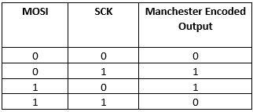

# CCL Manchester Encoder

This example application shows how to use the CCL peripheral library and generate a Manchester-encoded output.

## Description

This demonstrates a way to generate a Manchester-encoded output using a SPI port and the CCL. The SPI port is sending out a predefined buffer of data in a circular fashion. Data is sent out LSB first, with CCL_OUT being the Manchester-encoded output. Pins are configured such that a logic analyzer can be attached to see the input (MOSI and SCK) and the output (CCL_OUT) simultaneously.

## Downloading and building the application

To clone or download this application from Github, go to the [main page of this repository](https://github.com/Microchip-MPLAB-Harmony/csp_apps_sam_l22) and then click **Clone** button to clone this repository or download as zip file.
This content can also be downloaded using content manager by following these [instructions](https://github.com/Microchip-MPLAB-Harmony/contentmanager/wiki).

Path of the application within the repository is **apps/ccl/manchester_encoder/firmware** .

To build the application, refer to the following table and open the project using its IDE.

| Project Name      | Description                                    |
| ----------------- | ---------------------------------------------- |
| sam_l22_xpro.X | MPLABX project for [SAM L22 Xplained Pro Evaluation Kit](https://www.microchip.com/developmenttools/ProductDetails/ATSAML22-XPRO-B) |
|||

## Setting up the hardware

The following table shows the target hardware for the application projects.

| Project Name| Board|
|:---------|:---------:|
| sam_l22_xpro.X | [SAM L22 Xplained Pro Evaluation Kit](https://www.microchip.com/developmenttools/ProductDetails/ATSAML22-XPRO-B)
|||

### Setting up [SAM L22 Xplained Pro Evaluation Kit](https://www.microchip.com/developmenttools/ProductDetails/ATSAML22-XPRO-B)

- Use jumper from PA09 (EXT3 pin 15) to PA18 (EXT2 pin 16). This routes SCK to CCL_IN[2]
- Use jumper wire from PA08 (EXT3 pin 17) to PA05 (EXT2 pin 4). This routes MOSI to CCL_IN[1]
- PA07 (EXT3 pin 4) has CCL output (CCL_OUT)
- Connect the Debug USB port on the board to the computer using a micro USB cable

## Running the Application

1. Connect a logic analyzer to MOSI pin
2. Connect a logic analyzer to SCK pin
3. Connect a logic analyzer to the Manchester-encoded output CCL_OUT pin
4. Refer to the following table for pin details:
    |Board| MOSI pin | SCK pin  | CCL_OUT pin |
    |-----|----------|----------|-------------|
    | [SAM L22 Xplained Pro Evaluation Kit](https://www.microchip.com/developmenttools/ProductDetails/ATSAML22-XPRO-B) | PA09 (EXT3 pin 15) | PA08 (EXT3 pin 17) | PA07 (EXT3 pin 4) |
    ||||

5. Build and Program the application using its IDE
6. Observe the output on logic analyzer, it should follow the truth table as shown in the following diagram:

    
